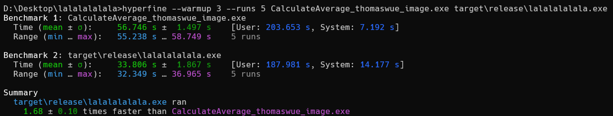

# 1brc-timeless

This repository contains rust code that can be used with 1brc (One Billion Row Challenge) dataset. *how the fuck did java #1 did it in 1 seconds*

## Running

Get yourself a `measurements.txt` and just run `cargo run -r`. It will spit out progress on reading file and time it take to parse file and do computation and a `out.json` file

## Perf

ran on my laptop (AMD Ryzen 7 7730U with 16 Gigabytes of RAM with 8 Cores and 16 Logical Processors) on Windows
| stuff                	| my implementation in rust 	| #1 java 1brc                 	|
|----------------------	|---------------------------	|------------------------------	|
| RAM Usage (Peak)     	| 3 Megabytes            	| 60+ Megabytes         	|
| Time to process      	| 36 seconds (pretty close)          	| 55 seconds                   	|
| Peak Disk Activities 	| 220+ MB/s                 	| 180+ MB/s 	|

## Special Thanks

- [0/0](https://github.com/tazz4843)
- acrimon (discord)
- erk (discord)
- and everyone else in Serenity Discord Bot Library Guild!
